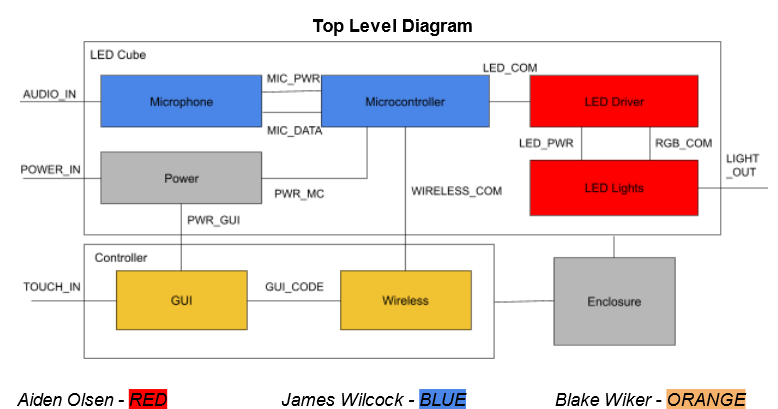

# Description of Block
This block takes in audio input from a microphone
and outputs it onto the led cube. It represents 
the volume of the audio by expanding outwards all along
the cube. For example, on no or very quiet volume it has no
light. If there is some volume then there is the led at 
the middle is lit thorugh all layers. If there is more volume 
than that a 3x3 square in the middle of the leds is lit
on all layers. At the max volume all leds on all layers will
be lit up.

# Top Level Block Diagram
{width=50%}

# Layer 1 code
```C
#include "audiomode.h"
int getvolume()
{
    float normalized = 0;
    int count = 0;
    int sum = 0;
    int time = millis();
    int sensorValue;
    while (millis() - time < 20)
    {
        sensorValue = analogRead(sensorPin);
        if (sensorValue > 1900)
        {
            sum += abs(sensorValue);
            count++;
        }
    }
    if (count == 0)
    {
        count = 1;
    }
    // Serial.println(count);
    // Serial.println(sum);
    normalized = abs((float(sum / count) - 1950) / (4096 - 1950));
    int volume = int(normalized * 100); // 0-100 volume
    int level = 0;
    if (volume < 15)
    {
        level = 0;
    }
    else if (volume < 30)
    {
        level = 1;
        // turn on [2][2]
    }
    else if (volume < 50)
    {
        level = 2;
        // turn on [1-3][1-3]
    }
    else
    {
        level = 3;
        // turn all on
    }
    return level;
}
```

# Code for manipulating the ledarray based on volume
```C
#include "audiomode.h"
int getvolume()
{
    float normalized = 0;
    int count = 0;
    int sum = 0;
    int time = millis();
    int sensorValue;
    while (millis() - time < 20)
    {
        sensorValue = analogRead(sensorPin);
        if (sensorValue > 1900)
        {
            sum += abs(sensorValue);
            count++;
        }
    }
    if (count == 0)
    {
        count = 1;
    }
    // Serial.println(count);
    // Serial.println(sum);
    normalized = abs((float(sum / count) - 1950) / (4096 - 1950));
    int volume = int(normalized * 100); // 0-100 volume
    int level = 0;
    if (volume < 15)
    {
        level = 0;
    }
    else if (volume < 30)
    {
        level = 1;
        // turn on [2][2]
    }
    else if (volume < 50)
    {
        level = 2;
        // turn on [1-3][1-3]
    }
    else
    {
        level = 3;
        // turn all on
    }
    return level;
}
```
