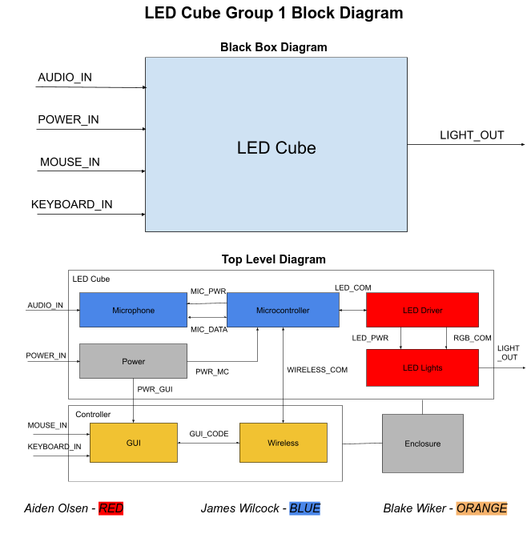
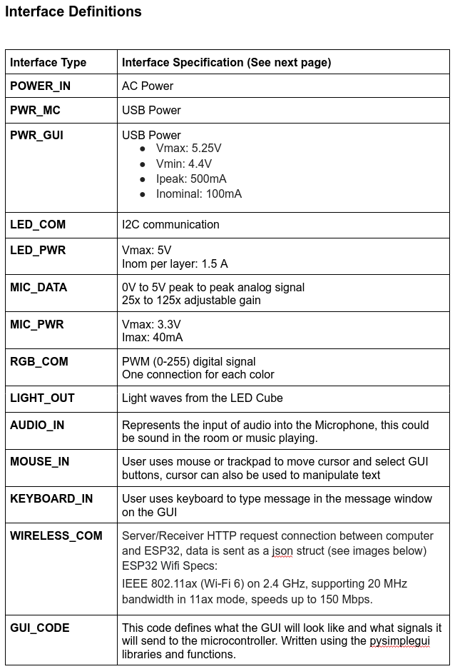
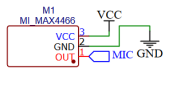

# Description of Block
This block takes in audio input from a microphone
and outputs it onto the led cube. It represents 
the volume of the audio by expanding outwards all along
the cube. For example, on no or very quiet volume it has no
light. If there is some volume then there is the led at 
the middle is lit thorugh all layers. If there is more volume 
than that a 3x3 square in the middle of the leds is lit
on all layers. At the max volume all leds on all layers will
be lit up.

# Electrical Characteristics

| Characteristic | Min | Max |
| --- | --- | --- |
|Current| 24uA | 60uA |
|Supplied Voltage | | 3.3v|
|Output Voltage | |3.3v/2 = 1.65V |


# Top Level Block Diagram
{width=75%}

# Interface definitions
{width=75%}

# Schematic 
{width=75%}

# Audio sampling code 
```C
#include "audiomode.h"
int getvolume()
{
    float normalized = 0;
    int count = 0;
    int sum = 0;
    int time = millis();
    int sensorValue;
    while (millis() - time < 20)
    {
        sensorValue = analogRead(sensorPin);
        if (sensorValue > 1900)
        {
            sum += abs(sensorValue);
            count++;
        }
    }
    if (count == 0)
    {
        count = 1;
    }
    // Serial.println(count);
    // Serial.println(sum);
    normalized = abs((float(sum / count) - 1950) / (4096 - 1950));
    int volume = int(normalized * 100); // 0-100 volume
    int level = 0;
    if (volume < 15)
    {
        level = 0;
    }
    else if (volume < 30)
    {
        level = 1;
        // turn on [2][2]
    }
    else if (volume < 50)
    {
        level = 2;
        // turn on [1-3][1-3]
    }
    else
    {
        level = 3;
        // turn all on
    }
    return level;
}
```
# Audio header file
```C
#ifndef AUDIOMODE_H
#define AUDIOMODE_H
#include <Arduino.h>
// TODO CHANGE pin for pcb to 34
#define sensorPin 35
int getvolume();
#endif
```

# Code for manipulating the ledarray based on volume
```C
int handlevolume(int volume, int color[3], int (*ledarray)[5][5][7][3])
{
  if (volume == 0)
  {
    // turn all off
    for (int x = 0; x < 5; x++)
    {
      for (int y = 0; y < 5; y++)
      {
        for (int z = 0; z < 7; z++)
        {
          (*ledarray)[x][y][z][0] = 0;
          (*ledarray)[x][y][z][1] = 0;
          (*ledarray)[x][y][z][2] = 0;
        }
      }
    }
  }
  else if (volume == 1)
  {
    // turn middle on
    for (int x = 0; x < 5; x++)
    {
      for (int y = 0; y < 5; y++)
      {
        for (int z = 0; z < 7; z++)
        {
          if (x == 2 && y == 2)
          {
            (*ledarray)[x][y][z][0] = color[0];
            (*ledarray)[x][y][z][1] = color[1];
            (*ledarray)[x][y][z][2] = color[2];
          }
          else
          {
            (*ledarray)[x][y][z][0] = 0;
            (*ledarray)[x][y][z][1] = 0;
            (*ledarray)[x][y][z][2] = 0;
          }
        }
      }
    }
  }
  else if (volume == 2)
  {
    // turn 3x3 middle on
    for (int x = 0; x < 5; x++)
    {
      for (int y = 0; y < 5; y++)
      {
        for (int z = 0; z < 7; z++)
        {
          if ((x >= 1 && x <= 3) && (y >= 1 && y <= 3))
          {
            (*ledarray)[x][y][z][0] = color[0];
            (*ledarray)[x][y][z][1] = color[1];
            (*ledarray)[x][y][z][2] = color[2];
          }
          else
          {
            (*ledarray)[x][y][z][0] = 0;
            (*ledarray)[x][y][z][1] = 0;
            (*ledarray)[x][y][z][2] = 0;
          }
        }
      }
    }
  }
  else if (volume == 3)
  {
    // all on
    for (int x = 0; x < 5; x++)
    {
      for (int y = 0; y < 5; y++)
      {
        for (int z = 0; z < 7; z++)
        {
          (*ledarray)[x][y][z][0] = color[0];
          (*ledarray)[x][y][z][1] = color[1];
          (*ledarray)[x][y][z][2] = color[2];
        }
      }
    }
  }
  return volume;
}
```
